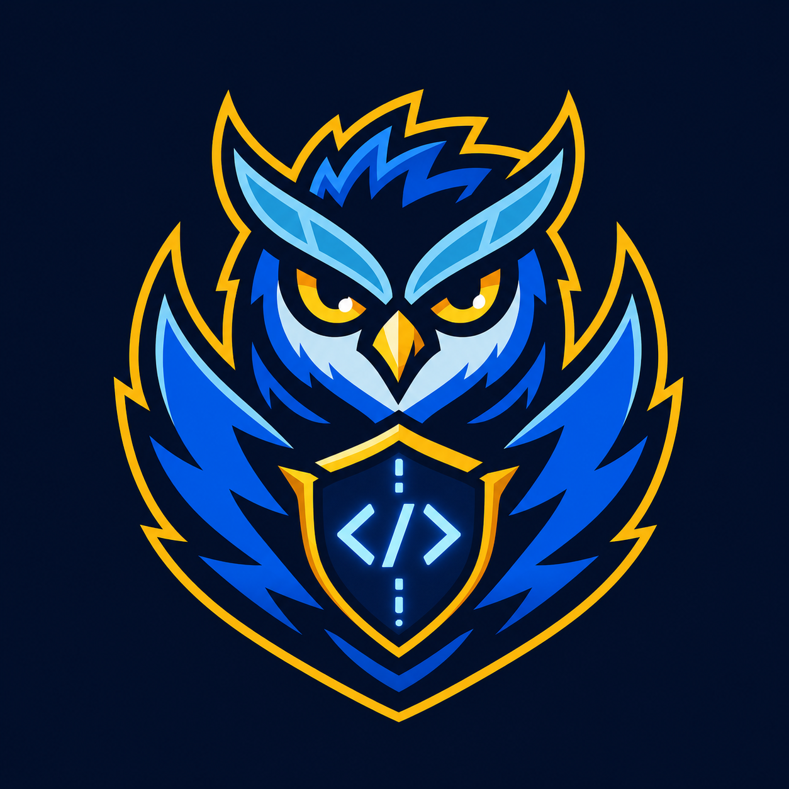

# Code Quality Guardian

[](https://github.com/crousty24-bit/code-quality-guardian-skill/actions/workflows/ci.yml)
[](https://skills.sh/crousty24-bit/code-quality-guardian-skill)
[](https://github.com/crousty24-bit/code-quality-guardian-skill/tree/0.1.0-beta.1)
[](LICENSE)

**Status:** MVP `0.1.0-beta.1`. Experimental, field-tested, and still under active evaluation.

Code Quality Guardian is an Agent Skill that disciplines how coding agents intervene in an existing codebase. It makes the agent inspect first, classify execution risk, constrain scope, preserve intended behavior, coordinate only necessary specialist skills, and report verification honestly.

Its central promise is simple: **change less, but better**.

## Why This Skill Exists

<p align="center">
  
</p>

Coding agents can produce technically plausible changes that are larger than the problem:

- unnecessary files and abstractions;
- imported architectures that do not match the project;
- unjustified dependencies;
- cosmetic or cross-cutting refactors;
- hidden behavior changes;
- verification claims without executed checks.

Code Quality Guardian treats this agent overproduction as a first-class engineering risk.

## Value Proposition

The skill adds an intervention layer before and during implementation:

1. Inspect the repository, local conventions, contracts, and available checks.
2. Separate facts, evidence, inference, and unknowns.
3. Classify the intervention as local, coordinated, or specialized.
4. Keep the business outcome bounded while adding only the disciplines required for safe execution.
5. Make the smallest justified change.
6. Report exact verification results and remaining uncertainty.

### Intervention Classification

| Level | Use when | Decision |
|---|---|---|
| `Level 1 Local` | One layer, stable contracts, targeted verification, no material migration, concurrency, or security risk | `stay local` |
| `Level 2 Coordinated` | One bounded outcome crosses files, layers, transports, or test suites | `coordinate with [...]` |
| `Level 3 Specialized` | Security, authorization, migration, concurrency, public API, performance, or complex diagnostic risk is material | `delegate to [...]` |

Code Quality Guardian remains responsible for scope at every level. Specialist skills add discipline; they do not widen the requested outcome.

## How It Differs From Review And Audit Skills

| Code Quality Guardian | Code review or audit skill |
|---|---|
| Governs how an agent should intervene | Evaluates code or a diff |
| Classifies execution risk before editing | Classifies findings and severity |
| Prevents scope creep and overproduction | Seeks defects across review dimensions |
| Coordinates specialist skills when justified | Often contains its own domain checklist |
| Can conclude that no edit is warranted | Usually returns review findings |
| Continues through implementation and verification | Often stops after analysis |

Code Quality Guardian can work alongside review, debugging, testing, security, API-design, migration, simplification, and performance skills. It does not replace them.

## What It Is Not

- A complete clean-code handbook.
- A replacement for `code-review`, TDD, security, debugging, or architecture skills.
- A framework-specific style guide.
- A static analyzer or proof that long files are defective.
- An auto-fixer, formatter, or code generator.
- A reason to invoke every available specialist skill.

## Compatibility

- Agent Skills-compatible coding agents.
- Tested primarily with Codex.
- Optional evidence scripts require Python `3.10+`.
- Scripts use only the Python standard library.
- Scripts perform no network access and do not rewrite project files.
- Detection includes common JavaScript/TypeScript and Python conventions, plus Rails/Ruby and Rust/Tauri patterns. It is not universal framework detection.

## Installation

### Inspect Available Skills

```bash
npx skills add crousty24-bit/code-quality-guardian-skill --list
```

### Install For Codex In The Current Project

```bash
npx skills add crousty24-bit/code-quality-guardian-skill \
  --skill code-quality-guardian \
  --agent codex \
  --yes
```

The CLI uses its normal installation strategy. Add `--copy` only when symbolic links are unsuitable for the environment.

### Install Globally

```bash
npx skills add crousty24-bit/code-quality-guardian-skill \
  --skill code-quality-guardian \
  --agent codex \
  --global \
  --yes
```

### Update

```bash
npx skills update code-quality-guardian --project --yes
```

Use `--global` instead of `--project` for a global installation.

### Remove

```bash
npx skills remove code-quality-guardian \
  --agent codex \
  --yes
```

### Verify Installation

```bash
npx skills list --agent codex
```

The expected installed skill name is `code-quality-guardian`. The repository name remains `code-quality-guardian-skill`; these names intentionally serve different purposes.

## Usage

### Explicit Invocation

```text
$code-quality-guardian Fix this validation issue with the smallest safe diff.
Classify the intervention before editing and report the checks you actually run.
```

```text
$code-quality-guardian Audit this codebase for agent overproduction risks.
Do not modify anything yet.
```

```text
$code-quality-guardian Implement this feature without broadening the public API.
Decide whether the work is local, coordinated, or specialized.
```

### Natural-Language Invocation

Agents that support implicit skill selection may activate it for requests involving:

- targeted refactors;
- code-quality audits;
- bug fixes where scope discipline matters;
- multi-layer changes requiring coordinated verification;
- reviews for scope creep or missing verification;
- maintainability work that must preserve behavior.

For repeatable field tests, invoke `$code-quality-guardian` explicitly.

## Evidence Scripts

Run scripts from the installed skill directory or reference them by their installed path.

```bash
python3 scripts/project_conventions_probe.py --root /path/to/project
python3 scripts/scan_file_lengths.py --root /path/to/project
python3 scripts/scan_function_lengths.py --root /path/to/project
python3 scripts/run_quality_checks.py --root /path/to/project
python3 scripts/risk_summary.py --root /path/to/project
```

All scripts support:

```text
--root PATH
--format markdown|json
--exclude PATTERN
```

The length scanners also support configurable thresholds:

```bash
python3 scripts/scan_file_lengths.py --root . --max-lines 400
python3 scripts/scan_function_lengths.py --root . --max-lines 80
```

Script output identifies inspection candidates, not defects. `run_quality_checks.py` only detects candidate commands; it never executes them.

## Repository Layout

```text
skills/code-quality-guardian/
├── SKILL.md
├── agents/
│   └── openai.yaml
├── examples/
├── references/
└── scripts/
```

Repository-level tests, contribution policies, and release documentation are intentionally kept outside the installable skill directory.

## Validation

Run the standard-library test suite:

```bash
python3 -m unittest discover -s tests -v
```

Validate the Agent Skills package:

```bash
skills-ref validate skills/code-quality-guardian
```

Verify CLI discovery:

```bash
npx skills add . --list --yes
```

The current suite covers project detection, Rails/Ruby, Rust/Tauri, NestJS, Python false positives, scanner behavior, read-only guarantees, linked resources, metadata, and package boundaries.

## Beta Status And Limitations

Version `0.1.0-beta.1` is an experimental MVP:

- two field-test phases have validated absolute behavior on several real repositories;
- Rails/Ruby and Rust/Tauri detection has been exercised on real projects;
- comparative improvement over the same agent without the skill is not yet proven;
- heuristic function scanning can produce false positives;
- specialist orchestration still requires broader comparative testing;
- compatibility outside the documented ecosystems is best effort.

Feedback should include the prompt, repository type, intervention classification, selected skills, commands executed, diff size, false positives, and remaining uncertainty.

## skills.sh

The repository follows the Agent Skills directory convention and is installable through the `skills` CLI. skills.sh rankings use anonymous CLI installation telemetry. The repository does not claim inclusion in the separate skills.sh **Official** category.

## Contributing And Support

- Read [CONTRIBUTING.md](CONTRIBUTING.md) before proposing changes.
- Use GitHub Issues for reproducible bugs and focused enhancement proposals.
- Read [SUPPORT.md](SUPPORT.md) for usage questions.
- Report vulnerabilities according to [SECURITY.md](SECURITY.md).
- Community participation is governed by [CODE_OF_CONDUCT.md](CODE_OF_CONDUCT.md).

## License

Released under the [MIT License](LICENSE).

## References

- [Agent Skills specification](https://agentskills.io/specification)
- [skills.sh documentation](https://skills.sh/docs)
- [skills CLI reference](https://skills.sh/docs/cli)
